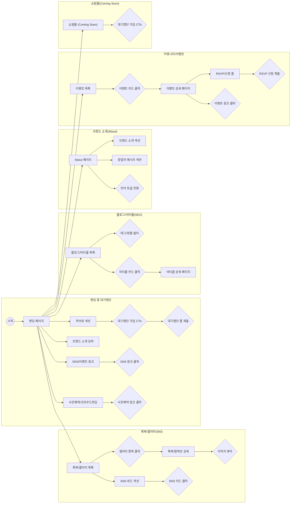

```mermaid
flowchart LR

  subgraph s1 ["랜딩 및 대기명단"]
    n1(("시작"))
    n2["랜딩 페이지"]
    n3["히어로 섹션"]
    n4["브랜드 소개 요약"]
    n5["SNS/이벤트 링크"]
    n6["사전예약/크라우드펀딩"]
    n7{"대기명단 가입 CTA"}
    n8{"대기명단 폼 제출"}
    n9{"SNS 링크 클릭"}
    n10{"사전예약 링크 클릭"}
  end

  subgraph s2 ["브랜드 소개(About)"]
    n11["About 페이지"]
    n12["브랜드 소개 섹션"]
    n13["창업자 메시지 섹션"]
    n14{"언어 토글 전환"}
  end

  subgraph s3 ["블로그/아티클(SEO)"]
    n15["블로그/아티클 목록"]
    n16["아티클 상세 페이지"]
    n17{"태그/정렬 필터"}
    n18{"아티클 카드 클릭"}
  end

  subgraph s4 ["룩북/갤러리/SNS"]
    n19["룩북/갤러리 목록"]
    n20["룩북/컬렉션 상세"]
    n21["SNS 피드 섹션"]
    n22{"갤러리 항목 클릭"}
    n23{"이미지 뷰어"}
    n24{"SNS 카드 클릭"}
  end

  subgraph s5 ["커뮤니티/이벤트"]
    n25["이벤트 목록"]
    n26["이벤트 상세 페이지"]
    n27["RSVP/신청 폼"]
    n28{"이벤트 카드 클릭"}
    n29{"RSVP 신청 제출"}
    n30{"이벤트 링크 클릭"}
  end

  subgraph s6 ["쇼핑몰(Coming Soon)"]
    n31["쇼핑몰 (Coming Soon)"]
    n32{"대기명단 가입 CTA"}
  end

  n1 --> n2
  n2 --> n3
  n2 --> n4
  n2 --> n5
  n2 --> n6
  n3 --> n7
  n7 --> n8
  n5 --> n9
  n6 --> n10
  n2 --> n11
  n11 --> n12
  n11 --> n13
  n11 --> n14
  n2 --> n15
  n15 --> n17
  n15 --> n18
  n18 --> n16
  n2 --> n19
  n19 --> n22
  n22 --> n20
  n20 --> n23
  n19 --> n21
  n21 --> n24
  n2 --> n25
  n25 --> n28
  n28 --> n26
  n26 --> n27
  n27 --> n29
  n26 --> n30
  n2 --> n31
  n31 --> n32
```
